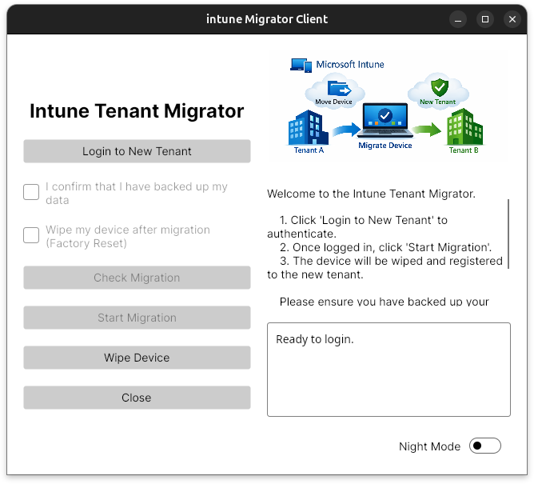

# Intune Migrator

A comprehensive solution for migrating devices from one Microsoft Intune tenant to another, ensuring seamless device migration with hardware hash management and device wiping capabilities.



## Table of Contents

- [Overview](#overview)
- [Architecture](#architecture)
- [Prerequisites](#prerequisites)
- [Building](#building)
- [Configuration](#configuration)
  - [Client Configuration](#client-configuration)
  - [Service Configuration](#service-configuration)
  - [Azure Applications](#azure-applications)
  - [Certificate Management](#certificate-management)
  - [Azure Web App Setup](#azure-web-app-setup)
- [Deployment](#deployment)
- [Usage](#usage)

## Overview

Intune Migrator is a three-component application designed to facilitate device migration between Microsoft Intune tenants:

1. **Client** - End-user facing application that enables users to authorize and initiate device migration
2. **Client Service** - Windows service that manages hardware hash retrieval and device wiping
3. **Web API** - Backend service that orchestrates tenant operations (device removal/addition)

## Architecture

```
┌─────────────────────────────────────────────┐
│         Intune Migrator Components          │
├─────────────────────────────────────────────┤
│                                             │
│  Client App (UI)                            │
│  └── Handles user authorization             │
│  └── Initiates migration workflow           │
│                                             │
│  Client Service (Windows Service)           │
│  └── Requests hardware hash                 │
│  └── Performs device wipe                   │
│                                             │
│  Web API (.NET 10.0)                        │
│  ├── Source Tenant Module                   │
│  ├── Destination Tenant Module              │
│  └── Migration Orchestration                │
│                                             │
└─────────────────────────────────────────────┘
```

## Prerequisites

### Required Software
- .NET 10.0 SDK for compiling
- .NET 10.0 Windows Desktop Runtime
- Windows (for client and service)
- (Optional) Wine 8+ on Linux (for signing Windows executables)

### Azure Requirements
- Microsoft Intune tenant(s)
- Azure Entra ID permissions
- Azure Key Vault (for production)
- Azure Web App or similar hosting environment

## Building

### Build Client (Linux)
```bash
dotnet build Client/intuneMigratorClient.csproj
```

### Build Service (Linux)
```bash
dotnet build Service/intuneMigratorService.csproj
```

### Build API
```bash
dotnet build Api/intuneMigratorApi.csproj
```

### Cross-Platform Builds
```bash
# Windows x64 Client
dotnet build Client/intuneMigratorClient.csproj -r win-x64

# Windows x64 Service
dotnet build Service/intuneMigratorService.csproj -r win-x64
```

## Configuration

### Client Configuration

#### Client Settings

The Settings.xml in the client config folder contains the application settings required for authentication, API communication, and application behavior.

- Authentication Settings
  - TenantId
    Specifies the Microsoft Entra ID (Azure AD) tenant ID used for user authentication.

  - ClientId
    Specifies the Application (Client) ID of the registered app in Microsoft Entra ID.

- Scopes
  Defines the permission scopes requested during authentication.
  Typically formatted as: api://{clientId}/{scopeName}

- API Configuration
  - ServerApiId: Base URL of the backend API.
  - ApiEndpointMigration: Relative API endpoint for starting a migration request.
  - ApiEndpointCheckMigration: Relative API endpoint for checking the status of a migration.

- Authentication Flow Options
  - DeviceCodeFlow: Determines which authentication flow is used:
    - true: Uses Device Code Flow: Useful for console applications or environments where a redirect URI is not possible.
  - false: Uses interactive browser login (authorization code flow)

  - RedirectUri: Redirect URI used during authentication. Must match the redirect URI configured in the app registration.

  - SpaOrigin: Origin used for CORS when calling the API.
  
- Security Settings
  - IgnoreSslErrors:
    - true: SSL certificate errors are ignored (for development only).
    - false: SSL certificates are strictly validated (recommended for production).

- Application Behavior
  - LogoPath: Path to the logo image used in the application UI.

  - WipeDevice: Controls device wipe behavior. Possible values:
    - false: No wipe is performed.
    - local: Local device wipe is performed.
    - remotelocal: Remote and local wipe actions are triggered.

  - Debug
    - true: Enables debug mode (extended logging, diagnostics).
    - false: Normal operation mode.

### Service Configuration

#### Service Settings

To secure the connection between client and service, a certificate is required. The Client Certificate Thumbprint has to be stored in the appsettings.json of the service. When empty, no client certificate check is done.

#### Create Windows Service
```cmd
sc.exe create ServiceName binPath=C:\path\to\intuneMigratorService.exe
```

### Azure Applications

#### Client Application
Configure an Azure AD application for the client with the following requirements:
- Tenant ID and Application ID
- Usage controlled via Azure AD groups
- When using Conditional Access, `Single-page application` authentication must be used in combination with SpaOrigin in the Settings.xml of the Client

#### Source Tenant & Destination Tenant Applications
Configure separate applications for source and destination tenants with these **required permissions**:

| Permission | Type | Purpose |
|-----------|------|---------|
| `Device.Read.All` | Application | Read device group tag attribute prior to Autopilot registration |
| `DeviceManagementManagedDevices.ReadWrite.All` | Application | Set primary user, delete Intune object from source tenant |
| `DeviceManagementServicesConfig.ReadWrite.All` | Application | Autopilot registration and device deletion |
| `User.Read.All` | Application | Read user attributes from Entra ID |
| `DeviceManagementManagedDevices.PrivilegedOperations.All` | Application | Perform remote wipe operations (only required when remote wipe is turned on in the Settings.xml of the Client) |

### Certificate Management

#### Windows (SignTool)
```powershell
# Create self-signed certificate
$selfSignedRootCA = New-SelfSignedCertificate `
  -DnsName sh@im.com `
  -NotAfter (Get-Date).AddMonths(12) `
  -CertStoreLocation "Cert:\CurrentUser\My" `
  -KeyExportPolicy Exportable `
  -Type CodeSigningCert `
  -KeySpec KeyExchange `
  -KeyLength 2048 `
  -KeyAlgorithm 'RSA' `
  -HashAlgorithm 'SHA256' `
  -FriendlyName "intuneMigrator"

# Export to PFX
$CertPassword = ConvertTo-SecureString -String "intuneMigrator" -Force -AsPlainText
$selfSignedRootCA | Export-PfxCertificate -FilePath C:\tmp\intuneMigrator.pfx -Password $CertPassword

# Sign executable
signtool.exe sign /fd SHA256 /f C:\tmp\intuneMigrator.pfx /p intuneMigrator "Client\bin\Debug\net10.0\win-x64\intuneMigratorClient.exe"
```

#### Linux / Wine Signing
```bash
# Sign executable
wine _Assets/osslsigncode/osslsigncode.exe sign \
  -pkcs12 _Assets/intuneMigrator.pfx \
  -pass intuneMigrator \
  -in "Client/bin/Debug/net10.0/win-x64/intuneMigratorClient.exe" \
  -out "Client/bin/Debug/net10.0/win-x64/intuneMigratorClient-signed.exe"

# Replace original with signed version
mv "Client/bin/Debug/net10.0/win-x64/intuneMigratorClient-signed.exe" \
   "Client/bin/Debug/net10.0/win-x64/intuneMigratorClient.exe"

# Verify signature
wine _Assets/osslsigncode/osslsigncode.exe verify \
  -in "Client/bin/Debug/net10.0/win-x64/intuneMigratorClient.exe"
```

For signing under Linux you can use osslsigncode: https://github.com/mtrojnar/osslsigncode

### Azure Web App Setup

#### Key Vault Configuration
Assign the following roles to the web app identity:
- `Key Vault Secrets User`
- `Key Vault Reader`

#### Environment Variables
```
IntuneDestinationTenantConfig__ClientSecret=@Microsoft.KeyVault(SecretUri=https://kv-intunemigration.vault.azure.net/secrets/DestinationTenantContoso/)

IntuneSourceTenantConfig__ClientSecret=@Microsoft.KeyVault(SecretUri=https://kv-intunemigration.vault.azure.net/secrets/SourceTenantContoso2/)

Database__ConnectionStrings__SQLiteConnection=Data Source=/home/data/intune-migration.db
```

#### Startup Command Linux
```
dotnet intuneMigratorApi.dll
```

## Deployment

### Publish API
```bash
# Linux .NET deployment
dotnet publish Api/intuneMigratorApi.csproj -c Release

# Self-contained Windows x64 deployment
dotnet publish Api/intuneMigratorApi.csproj -c Release -r win-x64 --self-contained true -o ./publish/api
```

### Publish Client
```bash
# Self-contained Windows x64 deployment
dotnet publish Client/intuneMigratorClient.csproj -c Release -r win-x64 --self-contained true -o ./publish/client
```

### Publish Service
```bash
# Self-contained Windows x64 deployment
dotnet publish Service/intuneMigratorService.csproj -c Release -r win-x64 --self-contained true -o ./publish/service
```

### Using Build Tasks
Alternatively, use the pre-configured VS Code tasks:
```bash
# Build all components for Windows x64
dotnet build (win-x64)

# Publish all components for Windows x64 (with code signing)
dotnet publish (win-x64)
```

## Usage

1. **Deploy the API** to your Azure Web App or hosting environment
2. **Deploy the Service** on target Windows machines
3. **Distribute the Client** to end users
4. Users launch the client application and follow the authorization flow
5. The system automatically handles device migration between tenants

---

## Repository Structure

```
intuneMigrator/
├── Api/              # .NET Web API for tenant operations
├── Client/           # WPF/Avalonia desktop client
├── Service/          # Windows background service
├── _Assets/          # Configuration, scripts, and tools
└── README.md         # This file
```

## Support & Contributing

For issues, feature requests, or contributions, please refer to the project's guidelines. Ensure all code follows the established patterns and is properly tested before submitting.

Idea from: https://stevecapacity.github.io/intune-device-migration-documentation/